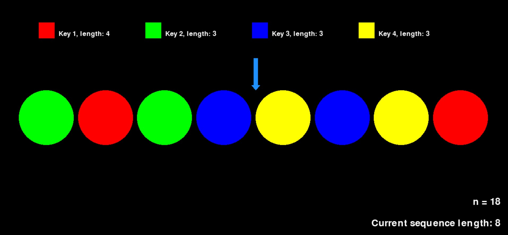

# **Combinatorial Game**

This repository contains Off-Diagonal Van der Waerden Combinatorial Game.

## Gam rules
Your task is to place **n** colorful tokens in a row.  As easy as it sounds, there's one caveat: You **must avoid** putting the tokens in the way that would create a monochromatic arithmetic series of tokens holding the same colours. For every colour, length of the forbidden series is displayed at the top of the screen - in every game session these parameters are chosen randomly. Computer is Your rival, choosing before Your moves where the upcoming token will be placed.

The game ends when You manage to place n tokens without falling in the computer's pitfall. For example, below we shouldn't put green token in our next move - otherwise there will be created a green arithmetic series of length 3 and that results in our loss.

## Download
You can download the game **[here]**()

